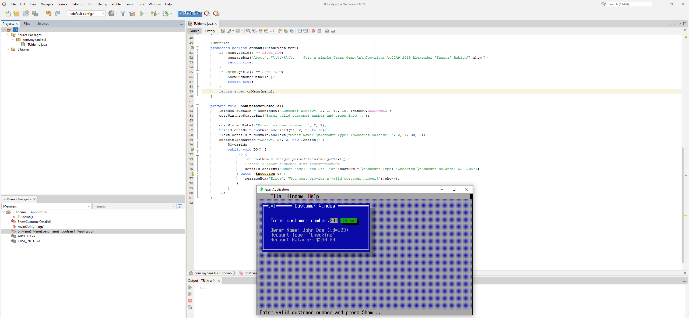
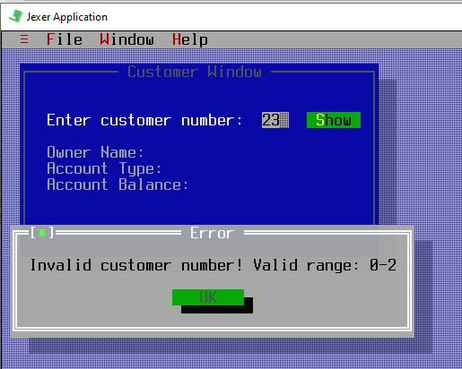
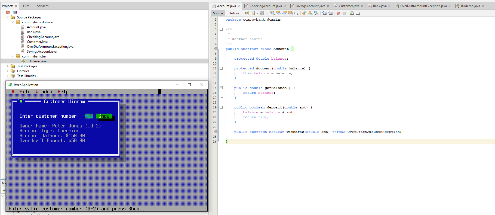

# Lab 1
# Створення багатовіконного TUI з допомогою Jexer
Мета роботи - навчитись створювати прості текстові інтерфейси з допомогою популярної бібліотеки.


## На "трійку"
1. Завантажте jar-файл Jexer з [cайту проекту](https://sourceforge.net/projects/jexer/files/latest/download) або з [цього ж репозиторію](https://github.com/liketaurus/TUI-Labs/blob/master/jars/jexer-0.3.0.jar)
2. Створіть в Netbeans новий проект з назвою TUIdemo. *УВАГА! Чекбокс *Create Main Class* треба **очистити** (**не створювати виконуваний клас**)!*
3. Додайте до проекту бібліотеку Jexer - правою кнопкой на проекті, обрати *Properties*, потім у дереві категорій обрати *Libraries* (другий пункт зверху), натиснути у правій частині вікна кнопку *Add JAR/Folder*, обрати jar-файл, завантажений у п. 1, натиснути *Ok*
4. Додайте до проекту файл **[TUIdemo.java](https://github.com/liketaurus/TUI-Labs/blob/master/Lab%201%20-TUI/TUIdemo.java)** з цього репозиторію
5. Вивчіть вихідний код у файлі, впевніться, що ви розумієте як він має працювати
6. Запустіть проект - ви маєте побачити вікно з меню та рядком статусу. Дослідіть пункти меню, впевніться, що всі вони працюють та надають корисну функціональність. Продемонстрируйте результат викладачеві.

```Java
package com.mybank.tui;

import jexer.TAction;
import jexer.TApplication;
import jexer.TField;
import jexer.TText;
import jexer.TWindow;
import jexer.event.TMenuEvent;
import jexer.menu.TMenu;

/**
 *
 * @author Alexander 'Taurus' Babich
 */
public class TUIdemo extends TApplication {

    private static final int ABOUT_APP = 2000;
    private static final int CUST_INFO = 2010;

    public static void main(String[] args) throws Exception {
        TUIdemo tdemo = new TUIdemo();
        (new Thread(tdemo)).start();
    }

    public TUIdemo() throws Exception {
        super(BackendType.SWING);

        addToolMenu();
        //custom 'File' menu
        TMenu fileMenu = addMenu("&File");
        fileMenu.addItem(CUST_INFO, "&Customer Info");
        fileMenu.addDefaultItem(TMenu.MID_SHELL);
        fileMenu.addSeparator();
        fileMenu.addDefaultItem(TMenu.MID_EXIT);
        //end of 'File' menu

        addWindowMenu();

        //custom 'Help' menu
        TMenu helpMenu = addMenu("&Help");
        helpMenu.addItem(ABOUT_APP, "&About...");
        //end of 'Help' menu

        setFocusFollowsMouse(true);
        //Customer window
        ShowCustomerDetails();
    }

    @Override
    protected boolean onMenu(TMenuEvent menu) {
        if (menu.getId() == ABOUT_APP) {
            messageBox("About", "\t\t\t\t\t    Just a simple Jexer demo.\n\nCopyright \u00A9 2019 Alexander 'Taurus' Babich").show();
            return true;
        }
        if (menu.getId() == CUST_INFO) {
            ShowCustomerDetails();
            return true;
        }
        return super.onMenu(menu);
    }

    private void ShowCustomerDetails() {
        TWindow custWin = addWindow("Customer Window", 2, 1, 40, 10, TWindow.NOZOOMBOX);
        custWin.newStatusBar("Enter valid customer number and press Show...");

        custWin.addLabel("Enter customer number: ", 2, 2);
        TField custNo = custWin.addField(24, 2, 3, false);
        TText details = custWin.addText("Owner Name: \nAccount Type: \nAccount Balance: ", 2, 4, 38, 8);
        custWin.addButton("&Show", 28, 2, new TAction() {
            @Override
            public void DO() {
                try {
                    int custNum = Integer.parseInt(custNo.getText());
                    //details about customer with index==custNum
                    details.setText("Owner Name: John Doe (id="+custNum+")\nAccount Type: 'Checking'\nAccount Balance: $200.00");
                } catch (Exception e) {
                    messageBox("Error", "You must provide a valid customer number!").show();
                }
            }
        });
    }
}
```


## Результат: 



## На "чотири"
1. Перепишіть метод **ShowCustomerDetails** з використанням класів *Bank, Customer, Account* та ін. з наших попередніх лаб - банк повинен мати як мінімум два клієнти, інформацію про яких (та про перші рахунки, що їм належать) ви маєте побачити, увівши номер клієнта. *УВАГА! Класи можна взяти або з [відповідного репозиторію](https://github.com/liketaurus/OOP-JAVA), або взяти [jar-файл](https://github.com/liketaurus/TUI-Labs/blob/master/jars/MyBank.jar) з усіма необхідними класами з цього ж репозиторію та підключити його як бібліотеку (див. п.3 завдання "на трійку).*
2. Запустіть проект, впевніться, що все працює як очікувалось. Продемонстрируйте результат викладачеві.


## На "п'ять"
1. Перепишіть метод **ShowCustomerDetails** з використанням класів *Bank, Customer, Account* та ін. з наших попередніх лаб - інформація про клієнтів банку та їх рахунках має читатись з файлу **test.dat** (робота номер 8, [файл даних](https://github.com/liketaurus/TUI-Labs/blob/master/data/test.dat) також є в цьому ж репозиторію). Інформацію про клієнта (та про перший рахунок, що йому належить) ви маєте побачити, увівши номер клієнта.
2. Запустіть проект, впевніться, що все працює як очікувалось. Продемонстрируйте результат викладачеві.

## Результат: 

`test.dat`

```Dat
CUSTOMER John Doe
ACCOUNT CHECKING 500.00 100.00
ACCOUNT SAVINGS 1200.00 0.03
CUSTOMER Jane Smith
ACCOUNT SAVINGS 750.00 0.02
ACCOUNT CHECKING 200.00
CUSTOMER Peter Jones
ACCOUNT CHECKING 150.00 50.00
```


